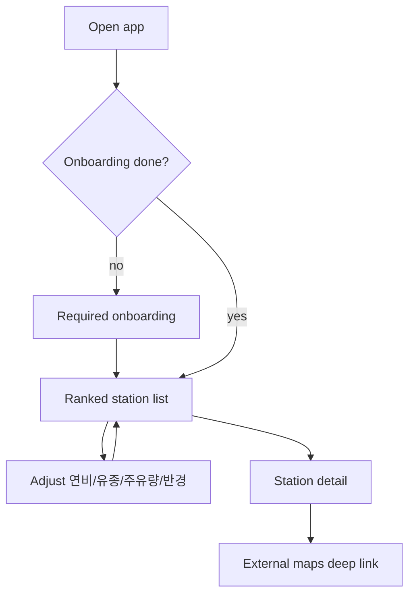

# Fuel Cost Ranker - Plan

## Goal Capsule

- **Objective:** 현재 위치와 사용자 차량 조건(연비·유종·주유량·검색 반경)으로 오피넷 유가 데이터를 불러와, 편도 이동 연료비와 주유 비용을 합친 총비용이 가장 낮은 주유소를 소팅·상세·길안내까지 연결하는 모바일 웹을 만든다.
- **Product authority:** 이 Product Contract가 사용자 행동·스코프·성공 기준의 권위본이다. 구현 방식은 이후 implementation plan에서 정한다.
- **Open blockers:** 위치 권한 거절 시 v1 동작(아래 Outstanding Questions).

## Product Contract

### Summary

오피넷 API 기반 모바일 웹으로, 주변 주유소를 **총비용(편도 이동 연료비 + 주유량 × 유가)** 오름차순으로 보여 준다.
첫 방문은 필수 온보딩으로 차량·유종·연비·주유량·반경을 확정하고, 이후에는 리스트에서 조건을 바로 바꿔 재소팅하며, 상세에서 외부 지도 앱으로 길안내한다.
설정은 기기(브라우저)에만 저장하며 로그인은 없다.

### Problem Frame

사람들은 보통 지도에서 “가까운 곳 중 싼 곳”을 고른다.
유가가 싸도 거리가 멀면 이동에 쓰는 연료비 때문에 손해가 날 수 있다.
리터당 가격만 비교하는 앱·지도로는 그 손해를 한눈에 보기 어렵다.

### Key Decisions

- **첫 방문 A, 이후 B.** 최초 접속은 필수 온보딩으로 입력을 끝낸 뒤 랭킹에 들어가고, 재방문부터는 리스트가 메인이며 조건을 즉시 조절한다. `(session-settled: user-directed — chosen over pure-B or pure-A: 정확 입력과 재방문 속도를 둘 다 확보)`
- **총비용 소팅.** 순위는 편도 기준 `이동 연료비 + (주유량 × 해당 주유소 유가)` 오름차순이다. 이동 연료비는 `(거리 ÷ 연비) × 해당 주유소 유가`로 둔다. `(session-settled: user-directed — chosen over travel-cost-only: 주유량 없이는 “가서 주유할 때” 손익이 빠짐)`
- **입력 세트.** v1 필수 조건은 연비, 유종, 주유량, 검색 반경이다. 주유량은 프리셋 + 리터 직접 입력, 반경은 3/5/10/20km 선택이다. `(session-settled: user-directed)`
- **차량 프리셋.** 온보딩 프리셋은 `그랜저 3.0 가솔린 · 공인연비 10.8km/L`처럼 **차종 + 유종 + 공인연비**를 한 세트로 제공한다. 선택 시 공인연비가 계산용 연비 초기값으로 채워지며, 사용자는 실연비로 수정할 수 있다. 목록에 없는 차는 직접 입력한다. `(session-settled: user-directed — chosen over fuel-type-only / 차종+유종-only presets)`
- **기기 저장, 무로그인.** 연비·유종·주유량·반경·온보딩 완료 여부는 브라우저에 기억한다. `(session-settled: user-approved — chosen over accounts: v1 마찰 최소화)`
- **길안내는 외부 지도 딥링크만.** 상세에서 카카오/네이버/구글 등 외부 지도 앱·웹으로 딥링크한다. 앱 내 지도 SDK·임베드 지도는 v1에 넣지 않는다. `(session-settled: user-directed — chosen over in-app map)`
- **플랫폼 골격.** 앱은 **Next.js**로 만들고 **Vercel**에 배포한다. 그 밖의 라이브러리·폴더 구조·상태관리 등 상세 기술 스택은 implementation plan에서 정한다. `(session-settled: user-directed)`
- **모바일 웹 우선.** 주유 직전 폰 사용을 1차 화면으로 잡는다. `(session-settled: user-approved)`
- **드리블급 비주얼.** 랜딩·리스트·상세는 프로모션/제품 랜딩에 가까운 한 장의 구성감과 의도된 모션을 목표로 한다. 카드 남용·히어로 오버레이·기본 시스템 폰트 느낌은 피한다.

### Actors

- A1. 자가용 운전자 — 주유 전후로 폰에서 “지금 어디가 진짜 싼지”를 보고 출발한다.
- A2. 오피넷 유가 데이터 — 주변 주유소 위치·유종별 가격의 출처.
- A3. 외부 지도 앱/웹 — 선택한 주유소까지 실제 길안내를 수행한다.

### Key Flows

- F1. 첫 방문 온보딩
  - **Trigger:** 온보딩 완료 플래그가 없는 상태로 앱을 연다.
  - **Actors:** A1
  - **Steps:** 위치 권한을 요청한다. 차종+유종+공인연비 프리셋을 고르거나 직접 입력한다. 공인연비로 채워진 연비를 확인하고 필요 시 실연비로 수정한다. 주유량(프리셋 또는 리터 입력)과 반경(3/5/10/20km)을 확정한다. 네 값이 모두 확정되기 전에는 랭킹으로 진행할 수 없다. 완료 시 기기에 저장하고 랭킹으로 이동한다.
  - **Outcome:** 저장된 조건으로 총비용 소팅 리스트가 보인다.
  - **Covered by:** R1, R2, R3, R8

- F2. 재방문 랭킹·조절
  - **Trigger:** 온보딩 완료 상태로 앱을 연다.
  - **Actors:** A1, A2
  - **Steps:** 저장된 조건과 현재 위치로 주변 주유소를 불러와 총비용 오름차순으로 보여 준다. 사용자는 연비·유종·주유량·반경을 리스트 화면에서 바로 바꾼다. 값이 바뀌면 순위를 다시 계산한다. 항목을 탭하면 상세로 간다.
  - **Outcome:** 조건 변경이 즉시 순위에 반영되고, 1등·후보를 같은 리스트에서 비교할 수 있다.
  - **Covered by:** R4, R5, R6, R9

- F3. 상세에서 출발
  - **Trigger:** 리스트 항목을 탭한다.
  - **Actors:** A1, A3
  - **Steps:** 상세에 상호·유종 가격·거리·이동 연료비·주유 비용·총비용·주소(가능 시)를 보여 준다. 길안내 CTA로 외부 지도에 목적지를 연다.
  - **Outcome:** 사용자는 앱을 떠나지 않고도 바로 출발 경로를 연다.
  - **Covered by:** R7, R10

### Requirements

**온보딩·설정**

- R1. 첫 방문에서는 연비·유종·주유량·검색 반경을 모두 확정하기 전에는 랭킹 화면에 진입할 수 없다.
- R2. 온보딩은 `차종 + 유종 + 공인연비`가 결합된 차량 프리셋을 제공한다. 선택 시 공인연비가 연비 초기값으로 채워지며, 사용자는 이를 수정할 수 있어야 한다. 프리셋에 없는 차는 직접 입력할 수 있어야 한다.
- R3. 주유량은 프리셋과 리터 단위 직접 입력을 모두 지원한다. 검색 반경은 3/5/10/20km 중 선택한다.
- R4. 연비·유종·주유량·반경·온보딩 완료 여부는 로그인 없이 기기에 저장되고, 다음 방문에 그대로 쓰인다.

**랭킹·상세**

- R5. 앱은 현재 위치와 검색 반경 안의 주유소를 오피넷 유가 데이터로 조회한다.
- R6. 리스트는 총비용 오름차순으로 소팅한다. 총비용 = `(거리 ÷ 연비) × 유가 + 주유량 × 유가` (편도, 해당 주유소 유가·선택 유종 기준).
- R7. 리스트 항목을 탭하면 상세에서 가격·거리·비용 분해·길안내 진입점을 보여 준다.
- R8. 위치·조건·결과 로딩·빈 결과·API 실패 상태를 사용자가 이해할 수 있게 구분해서 보여 준다.

**출발·품질**

- R9. 재방문 기준, 위치 권한이 이미 허용된 상태에서 저장된 조건으로 앱을 열면 약 30초 안에 1등 주유소와 총비용이 보여야 한다.
- R10. 상세에서 외부 지도(최소 1개 이상, 가능하면 복수 옵션)로 해당 주유소 길안내를 열 수 있어야 한다.
- R11. 1차 UI는 모바일 뷰포트에 최적화한다. 드리블에 올라올 법한 한 장의 히어로/리스트 구성과 의도된 모션(최소 2–3개)을 포함한다.

### Acceptance Examples

- AE1. 첫 방문 차단
  - **Covers:** R1
  - **Given:** 온보딩 미완료 사용자
  - **When:** 연비만 넣고 주유량·반경을 비운 채 다음을 누른다
  - **Then:** 랭킹으로 가지 않고, 남은 필수 입력을 완료하라는 상태가 유지된다

- AE2. 프리셋 공인연비 적용 후 보정
  - **Covers:** R2
  - **Given:** 온보딩에서 `그랜저 3.0 가솔린 · 공인연비 10.8km/L` 프리셋을 고른다
  - **When:** 공인연비로 채워진 연비 필드를 11.2로 고치고 저장한다
  - **Then:** 이후 총비용 계산은 11.2km/L과 해당 유종을 사용한다. 프리셋 목록/선택 UI에는 공인연비가 함께 보인다

- AE3. 멀리 싼 곳 vs 가까이 조금 비싼 곳
  - **Covers:** R6
  - **Given:** 주유량 40L, 연비 12km/L, 반경 10km. 주유소 A는 2km·리터당 더 비싸고, B는 9km·리터당 더 싸다
  - **When:** 랭킹을 계산한다
  - **Then:** 순서는 총비용(이동+주유)이 낮은 쪽이 위이며, 리터당 가격만의 순서와 달라질 수 있다

- AE4. 조건 변경 즉시 재소팅
  - **Covers:** R4, R6
  - **Given:** 재방문 리스트가 보인다
  - **When:** 반경을 10km에서 5km로 바꾼다
  - **Then:** 5km 밖 주유소가 사라지고 남은 항목의 총비용 순으로 다시 정렬되며, 선택값은 기기에 기억된다

- AE5. 길안내 연결
  - **Covers:** R10
  - **Given:** 상세 화면
  - **When:** 길안내 CTA를 누른다
  - **Then:** 해당 주유소를 목적지로 하는 외부 지도가 열린다

### Success Criteria

- 재방문·위치 허용 상태에서 약 30초 안에 1등 주유소와 총비용이 보인다.
- 상세에서 외부 지도로 바로 출발할 수 있다.
- “리터당 최저”와 “총비용 최저”가 다를 수 있음을 리스트·상세의 비용 분해로 이해할 수 있다.
- 모바일에서 첫 화면이 한 장의 제품 화면처럼 읽히고, 의도된 모션이 2–3개 이상 느껴진다.

### Scope Boundaries

**Deferred for later**

- 왕복 이동비, 경로(출근길) 기반 추천
- 로그인·클라우드 동기화, PWA 홈 화면 추가
- 앱 내 지도·마커
- 가격 알림·푸시, 즐겨찾기·방문 이력
- 데스크톱 동등 UX

**Outside this product's identity**

- 단순 유가 게시판(총비용 없는 가격 나열만)
- 정비·세차·멤버십 포인트 최적화 플랫폼

### Dependencies / Assumptions

- 앱은 Next.js 애플리케이션으로 구현하고 Vercel에 배포한다.
- 오피넷 Open API로 주변 주유소 위치와 유종별 가격을 조회할 수 있다.
- 브라우저 Geolocation으로 현재 위치를 얻는다.
- 길안내는 외부 지도 딥링크만 사용한다(앱 내 지도 없음).
- 이동 거리는 직선 거리(또는 오피넷/지도가 주는 동등한 근사)로 계산해도 v1 의사결정에 충분하다.
- 이동 구간에 쓰는 유가도 목적지 주유소 유가로 근사한다.
- 차량 프리셋의 공인연비는 공개된 공인/복합 연비 대표값이며, 계산에는 사용자가 확정한 연비(기본값=공인연비, 수정 가능)를 쓴다.

### Outstanding Questions

**Resolve Before Planning**

- Q1. 위치 권한을 거절했을 때 v1은 권한 재요청 안내만 할 것인가, 주소/지도 핀 수동 입력으로 위치를 받을 것인가?

**Deferred to Planning**

- Q2. 차량 프리셋 목록의 규모와 구체 차종·공인연비 수치 출처(에너지효율등급/제조사 제원 등).
- Q3. 외부 지도 딥링크를 어느 앱까지 기본 제공할 것인가.
- Q4. 리스트에 노출할 상위 개수·동일 총비용 시 타이브레이크(거리 우선 등).
- Q5. 오피넷 API 키·프록시·호출 한도를 Vercel/Next 환경에서 어떻게 둘 것인가.
- Q6. Next.js 버전·스타일링·폼/상태 등 상세 기술 스택 선택.
