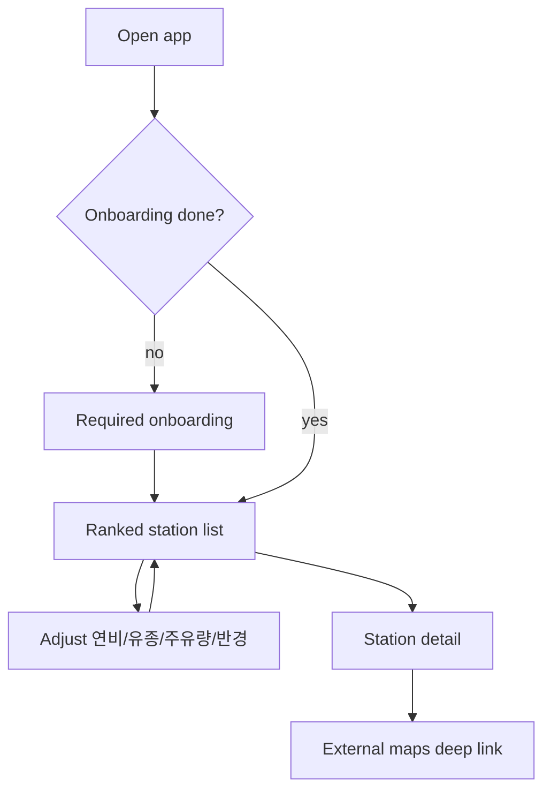
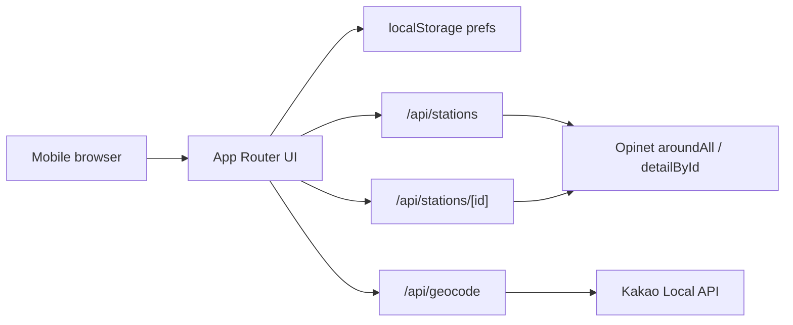

# Fuel Cost Ranker - Plan

## Goal Capsule

- **Objective:** 현재 위치와 사용자 차량 조건(연비·유종·주유량·검색 반경)으로 오피넷 유가 데이터를 불러와, 편도 이동 연료비와 주유 비용을 합친 총비용이 가장 낮은 주유소를 소팅·상세·길안내까지 연결하는 모바일 웹을 만든다.
- **Product authority:** Product Contract가 사용자 행동·스코프·성공 기준의 권위본이다. Planning Contract / KTDs가 HOW의 권위본이다.
- **Open blockers:** 없음.
- **Execution profile:** code. Greenfield Next.js app on Vercel; test-first for cost ranking and Opinet mapping pure functions; UI units verified with component/smoke checks.
- **Stop conditions:** R1–R12와 AE1–AE6을 만족하고, `OPINET_API_KEY` 없이 클라이언트에서 키가 노출되지 않으며, Vercel 배포로 랭킹·길안내가 동작하면 완료.
- **Product Contract preservation:** changed R3 / Key Decision 입력 세트 반경 — `3/5/10/20km` → `3/5km` only. Opinet `aroundAll.do` radius max is 5000m; 10/20 deferred.

## Product Contract

### Summary

오피넷 API 기반 모바일 웹으로, 주변 주유소를 **총비용(편도 이동 연료비 + 주유량 × 유가)** 오름차순으로 보여 준다.
첫 방문은 필수 온보딩으로 차량·유종·연비·주유량·반경을 확정하고, 이후에는 리스트에서 조건을 바로 바꿔 재소팅하며, 상세에서 외부 지도 앱으로 길안내한다.
위치는 브라우저 권한을 우선하고, 거절 시에는 주소/좌표 수동 입력으로 기준 위치를 받는다.
설정은 기기(브라우저)에만 저장하며 로그인은 없다.

### Problem Frame

사람들은 보통 지도에서 “가까운 곳 중 싼 곳”을 고른다.
유가가 싸도 거리가 멀면 이동에 쓰는 연료비 때문에 손해가 날 수 있다.
리터당 가격만 비교하는 앱·지도로는 그 손해를 한눈에 보기 어렵다.

### Key Decisions

- **첫 방문 A, 이후 B.** 최초 접속은 필수 온보딩으로 입력을 끝낸 뒤 랭킹에 들어가고, 재방문부터는 리스트가 메인이며 조건을 즉시 조절한다. `(session-settled: user-directed — chosen over pure-B or pure-A: 정확 입력과 재방문 속도를 둘 다 확보)`
- **총비용 소팅.** 순위는 편도 기준 `이동 연료비 + (주유량 × 해당 주유소 유가)` 오름차순이다. 이동 연료비는 `(거리 ÷ 연비) × 해당 주유소 유가`로 둔다. `(session-settled: user-directed — chosen over travel-cost-only: 주유량 없이는 “가서 주유할 때” 손익이 빠짐)`
- **입력 세트.** v1 필수 조건은 연비, 유종, 주유량, 검색 반경이다. 주유량은 프리셋 + 리터 직접 입력, 반경은 **3km / 5km**만 제공한다. `(session-settled: user-directed; 반경 상한은 Opinet API 5000m 한도에 맞춰 planning에서 축소 — 10/20km deferred)`
- **차량 프리셋.** 온보딩 프리셋은 `그랜저 3.0 가솔린 · 공인연비 10.8km/L`처럼 **차종 + 유종 + 공인연비**를 한 세트로 제공한다. 선택 시 공인연비가 계산용 연비 초기값으로 채워지며, 사용자는 실연비로 수정할 수 있다. 목록에 없는 차는 직접 입력한다. `(session-settled: user-directed — chosen over fuel-type-only / 차종+유종-only presets)`
- **기기 저장, 무로그인.** 연비·유종·주유량·반경·온보딩 완료 여부는 브라우저에 기억한다. `(session-settled: user-approved — chosen over accounts: v1 마찰 최소화)`
- **길안내는 외부 지도 딥링크만.** 상세에서 카카오/네이버/구글 등 외부 지도 앱·웹으로 딥링크한다. 앱 내 지도 SDK·임베드 지도는 v1에 넣지 않는다. `(session-settled: user-directed — chosen over in-app map)`
- **위치 거절 시 수동 입력.** 위치 권한이 없거나 거절되면 주소 또는 좌표 수동 입력으로 기준 위치를 받아 랭킹을 계속한다. `(session-settled: user-directed — chosen over permission-only gate)`
- **플랫폼 골격.** 앱은 **Next.js**로 만들고 **Vercel**에 배포한다. `(session-settled: user-directed)`
- **모바일 웹 우선.** 주유 직전 폰 사용을 1차 화면으로 잡는다. `(session-settled: user-approved)`
- **드리블급 비주얼.** 랜딩·리스트·상세는 프로모션/제품 랜딩에 가까운 한 장의 구성감과 의도된 모션을 목표로 한다. 카드 남용·히어로 오버레이·기본 시스템 폰트 느낌은 피한다.

### Actors

- A1. 자가용 운전자 — 주유 전후로 폰에서 “지금 어디가 진짜 싼지”를 보고 출발한다.
- A2. 오피넷 유가 데이터 — 주변 주유소 위치·유종별 가격의 출처.
- A3. 외부 지도 앱/웹 — 선택한 주유소까지 실제 길안내를 수행한다.

### Key Flows

- F1. 첫 방문 온보딩
  - **Trigger:** 온보딩 완료 플래그가 없는 상태로 앱을 연다.
  - **Actors:** A1
  - **Steps:** 위치 권한을 요청한다. 허용되면 GPS 좌표를 쓰고, 거절·실패 시 주소/좌표 수동 입력으로 기준 위치를 받는다. 차종+유종+공인연비 프리셋을 고르거나 직접 입력한다. 공인연비로 채워진 연비를 확인하고 필요 시 실연비로 수정한다. 주유량(프리셋 또는 리터 입력)과 반경(3/5km)을 확정한다. 기준 위치와 네 값이 모두 확정되기 전에는 랭킹으로 진행할 수 없다. 완료 시 기기에 저장하고 랭킹으로 이동한다.
  - **Outcome:** 저장된 조건으로 총비용 소팅 리스트가 보인다.
  - **Covered by:** R1, R2, R3, R8, R12

- F2. 재방문 랭킹·조절
  - **Trigger:** 온보딩 완료 상태로 앱을 연다.
  - **Actors:** A1, A2
  - **Steps:** 저장된 조건과 현재 위치로 주변 주유소를 불러와 총비용 오름차순으로 보여 준다. 사용자는 연비·유종·주유량·반경을 리스트 화면에서 바로 바꾼다. 값이 바뀌면 순위를 다시 계산한다. 항목을 탭하면 상세로 간다.
  - **Outcome:** 조건 변경이 즉시 순위에 반영되고, 1등·후보를 같은 리스트에서 비교할 수 있다.
  - **Covered by:** R4, R5, R6, R9

- F3. 상세에서 출발
  - **Trigger:** 리스트 항목을 탭한다.
  - **Actors:** A1, A3
  - **Steps:** 상세에 상호·유종 가격·거리·이동 연료비·주유 비용·총비용·주소(가능 시)를 보여 준다. 길안내 CTA로 외부 지도에 목적지를 연다.
  - **Outcome:** 사용자는 앱을 떠나지 않고도 바로 출발 경로를 연다.
  - **Covered by:** R7, R10

### Requirements

**온보딩·설정**

- R1. 첫 방문에서는 기준 위치와 연비·유종·주유량·검색 반경을 모두 확정하기 전에는 랭킹 화면에 진입할 수 없다.
- R2. 온보딩은 `차종 + 유종 + 공인연비`가 결합된 차량 프리셋을 제공한다. 선택 시 공인연비가 연비 초기값으로 채워지며, 사용자는 이를 수정할 수 있어야 한다. 프리셋에 없는 차는 직접 입력할 수 있어야 한다.
- R3. 주유량은 프리셋과 리터 단위 직접 입력을 모두 지원한다. 검색 반경은 **3km / 5km** 중 선택한다.
- R4. 연비·유종·주유량·반경·온보딩 완료 여부는 로그인 없이 기기에 저장되고, 다음 방문에 그대로 쓰인다.

**랭킹·상세**

- R5. 앱은 기준 위치와 검색 반경 안의 주유소를 오피넷 유가 데이터로 조회한다. 기준 위치는 브라우저 Geolocation을 우선한다.
- R6. 리스트는 총비용 오름차순으로 소팅한다. 총비용 = `(거리 ÷ 연비) × 유가 + 주유량 × 유가` (편도, 해당 주유소 유가·선택 유종 기준).
- R7. 리스트 항목을 탭하면 상세에서 가격·거리·비용 분해·길안내 진입점을 보여 준다.
- R8. 위치·조건·결과 로딩·빈 결과·API 실패 상태를 사용자가 이해할 수 있게 구분해서 보여 준다.
- R12. 위치 권한이 거절되거나 위치를 얻을 수 없으면, 주소 또는 좌표 수동 입력으로 기준 위치를 받아 랭킹을 계속할 수 있어야 한다.

**출발·품질**

- R9. 재방문 기준, 위치 권한이 이미 허용된 상태에서 저장된 조건으로 앱을 열면 약 30초 안에 1등 주유소와 총비용이 보여야 한다.
- R10. 상세에서 외부 지도(최소 1개 이상, 가능하면 복수 옵션)로 해당 주유소 길안내를 열 수 있어야 한다.
- R11. 1차 UI는 모바일 뷰포트에 최적화한다. 드리블에 올라올 법한 한 장의 히어로/리스트 구성과 의도된 모션(최소 2–3개)을 포함한다.

### Acceptance Examples

- AE1. 첫 방문 차단
  - **Covers:** R1
  - **Given:** 온보딩 미완료 사용자
  - **When:** 연비만 넣고 주유량·반경을 비운 채 다음을 누른다
  - **Then:** 랭킹으로 가지 않고, 남은 필수 입력을 완료하라는 상태가 유지된다

- AE2. 프리셋 공인연비 적용 후 보정
  - **Covers:** R2
  - **Given:** 온보딩에서 `그랜저 3.0 가솔린 · 공인연비 10.8km/L` 프리셋을 고른다
  - **When:** 공인연비로 채워진 연비 필드를 11.2로 고치고 저장한다
  - **Then:** 이후 총비용 계산은 11.2km/L과 해당 유종을 사용한다. 프리셋 목록/선택 UI에는 공인연비가 함께 보인다

- AE3. 멀리 싼 곳 vs 가까이 조금 비싼 곳
  - **Covers:** R6
  - **Given:** 주유량 40L, 연비 12km/L, 반경 5km. 주유소 A는 2km·리터당 더 비싸고, B는 4.5km·리터당 더 싸다
  - **When:** 랭킹을 계산한다
  - **Then:** 순서는 총비용(이동+주유)이 낮은 쪽이 위이며, 리터당 가격만의 순서와 달라질 수 있다

- AE4. 조건 변경 즉시 재소팅
  - **Covers:** R4, R6
  - **Given:** 재방문 리스트가 보인다
  - **When:** 반경을 5km에서 3km로 바꾼다
  - **Then:** 3km 밖 주유소가 사라지고 남은 항목의 총비용 순으로 다시 정렬되며, 선택값은 기기에 기억된다

- AE5. 길안내 연결
  - **Covers:** R10
  - **Given:** 상세 화면
  - **When:** 길안내 CTA를 누른다
  - **Then:** 해당 주유소를 목적지로 하는 외부 지도가 열린다

- AE6. 위치 거절 후 수동 입력
  - **Covers:** R12
  - **Given:** 사용자가 위치 권한을 거절했다
  - **When:** 주소 또는 좌표로 기준 위치를 입력하고 온보딩/설정을 마친다
  - **Then:** 그 위치를 기준으로 반경 내 주유소 총비용 랭킹이 표시된다. 권한 없이는 진행 불가인 상태로 멈추지 않는다

### Success Criteria

- 재방문·위치 허용 상태에서 약 30초 안에 1등 주유소와 총비용이 보인다.
- 상세에서 외부 지도로 바로 출발할 수 있다.
- “리터당 최저”와 “총비용 최저”가 다를 수 있음을 리스트·상세의 비용 분해로 이해할 수 있다.
- 모바일에서 첫 화면이 한 장의 제품 화면처럼 읽히고, 의도된 모션이 2–3개 이상 느껴진다.

### Scope Boundaries

**Deferred for later**

- 검색 반경 10km / 20km (Opinet `aroundAll` 단일 호출 상한 5km 초과)
- 왕복 이동비, 경로(출근길) 기반 추천
- 로그인·클라우드 동기화, PWA 홈 화면 추가
- 앱 내 지도·마커
- 가격 알림·푸시, 즐겨찾기·방문 이력
- 데스크톱 동등 UX

**Outside this product's identity**

- 단순 유가 게시판(총비용 없는 가격 나열만)
- 정비·세차·멤버십 포인트 최적화 플랫폼

### Dependencies / Assumptions

- 앱은 최신 Next.js(App Router) + TypeScript + Tailwind v4로 구현하고 Vercel에 배포한다. 패키지 매니저는 pnpm, 모션은 `motion`, 단위 테스트는 Vitest.
- 오피넷 Open API `aroundAll.do` / `detailById.do`로 주변 주유소·상세를 조회한다. 반경 파라미터 최대 5000m.
- 브라우저 Geolocation을 우선하고, 실패·거절 시 수동 입력 좌표/주소로 기준 위치를 정한다.
- 길안내는 외부 지도 딥링크만 사용한다(앱 내 지도 없음).
- 이동 거리는 오피넷이 반환하는 `DISTANCE`(m)를 편도 거리로 쓴다.
- 이동 구간에 쓰는 유가도 목적지 주유소 유가로 근사한다.
- 차량 프리셋의 공인연비는 공개 제원 대표값이며, 계산에는 사용자가 확정한 연비를 쓴다.

---

## Planning Contract

### Key Technical Decisions

- **KTD1. Latest Next.js App Router stack on Vercel.** `(session-settled: user-directed — Next + Vercel; versions/tooling user-approved as agent-chosen best practice)` Scaffold with **current latest** at implement time (research snapshot 2026-07-26: `next@16.x`, `react@19.x`, `typescript@latest`, `tailwindcss@4.x`). App Router + Route Handlers for Opinet/geocode. Tailwind v4 + CSS variables for brand tokens. No UI component library for v1. Prefer `create-next-app` defaults compatible with that stack, then add Vitest/`motion`.
- **KTD1b. Package manager: pnpm.** Use **pnpm** (Corepack-enabled) with committed `pnpm-lock.yaml`. Scripts and Verification Contract use `pnpm …` only. Chosen over npm/yarn for strict lockfile + efficient node_modules on Vercel.
- **KTD1c. Unit tests: Vitest (latest).** Domain/mapper/prefs tests via Vitest latest at implement time (snapshot: `vitest@4.x`).
- **KTD1d. Motion: `motion` (latest).** Use the **`motion`** package (Framer Motion 계열 최신 패키지명) for list enter, #1 highlight, detail transition. Keep motions intentional (2–3), not decorative noise.
- **KTD2. Server-only Opinet proxy.** `OPINET_API_KEY` lives in Vercel/server env only. Client calls `app/api/stations/route.ts` (and detail) with WGS84 lat/lng + prodcd + radiusKm; server converts to KATEC, calls `aroundAll.do`, maps JSON, never returns the key.
- **KTD3. WGS84 ↔ KATEC conversion in server module.** Opinet requires KATEC `x`/`y`. Implement a tested converter (proj4 or well-known Korea TM/KATEC constants) in `src/lib/geo/katec.ts`. Client stays on WGS84.
- **KTD4. Total-cost pure domain module.** `src/lib/cost/totalCost.ts` owns the formula and sort/tiebreak. Distance from Opinet is meters → km. Tiebreak: lower total cost, then shorter distance, then lower liter price, then `UNI_ID`.
- **KTD5. Preferences in `localStorage`.** Key `siljuyu.prefs.v1`: onboardingDone, efficiencyKmPerL, fuelType, fillLiters, radiusKm (3|5), optional lastOrigin `{lat,lng,label}`, optional vehiclePresetId. No cookies/auth.
- **KTD6. Manual location without in-app map.** Primary: address search via Kakao Local REST (`KAKAO_REST_API_KEY`, server Route Handler). Always-available fallback: lat/lng number inputs. No map SDK.
- **KTD7. Map deep links: Kakao + Naver + Google.** Build URLs from WGS84 (convert station KATEC→WGS84 once) and station name. Open in new tab / `window.location` on mobile.
- **KTD8. List presentation.** Fetch all stations in radius (`sort=2` distance from Opinet is fine; we re-sort by total cost). Show ranked list capped at **30** rows for UI. Detail loads `detailById.do` for address when opened.
- **KTD9. Vehicle presets as static data.** `src/data/vehiclePresets.ts` — ~10 popular KR models (차종+유종+공인연비). Values are curated placeholders from public 공인/복합 연비; document source comment. User can always override efficiency.
- **KTD10. Fuel type codes.** UI: 휘발유 `B027`, 경유 `D047`, 고급휘발유 `B034`, LPG `K015`. Default onboarding starts unset until user picks (or preset fills).
- **KTD11. Visual system.** Distinct non-default type via `next/font` (avoid Inter/Roboto/Arial/system as the hero face), atmospheric gradient/pattern background, full-bleed mobile hero on first paint of rank view. Motions via **KTD1d**. No purple-on-white / cream-terracotta / broadsheet clichés. Cards only where interaction needs a container.

### High-Level Technical Design

**Data path:** WGS84 origin → server KATEC → Opinet `aroundAll` (`radius` 3000|5000, `prodcd`, `out=json`) → map to domain stations → attach `travelCost` / `fillCost` / `totalCost` → sort → UI.

**Routes (app):**
- `/` — if !onboardingDone → redirect `/onboarding`; else rank experience
- `/onboarding` — F1
- `/station/[id]` — detail (or client sheet; prefer dedicated route for shareable deep link later)

### Assumptions

- Opinet JSON shape mirrors XML fields (`RESULT.OIL` array). Implement defensive parsing.
- `DISTANCE` from Opinet is acceptable one-way distance for v1 (no routing engine).
- Kakao REST key is available for address search in deployed env; lat/lng fallback covers local/dev without it.
- Curated preset 공인연비 need not be exhaustively certified for v1; label as 공인연비(참고) and allow edit.
- Existing saved prefs with radius 10/20 (if any from earlier prototypes) clamp to 5.

### Implementation Constraints

- Never expose `OPINET_API_KEY` or `KAKAO_REST_API_KEY` to the client bundle.
- Radius UI and API must not request >5000m.
- No in-app map SDK.
- Mobile-first CSS; desktop usable but not equal polish.
- Korean UI copy.

### Sequencing

1. U1 scaffold → U2 domain → U3 Opinet API → U4 prefs  
2. U5 onboarding + U8 manual location (can parallel after U3/U4)  
3. U6 rank list → U7 detail/maps → U9 visual polish  
4. U10 env/README/deploy checklist  

### Risks & Dependencies

- **Opinet key / CORS:** Must proxy; client direct call will fail or leak key.
- **KATEC accuracy:** Wrong conversion → empty/wrong stations. Unit-test known Seoul lat/lng → approximate KATEC against Opinet sample coords.
- **Kakao geocode optional:** Address search degrades to lat/lng if key missing — surface clear UI.
- **Opinet rate/availability:** Show R8 error state; no retry storm (single retry max).
- **Design taste risk:** Follow frontend hard rules in user preferences; avoid AI-default palettes.

### Sources / Research

- Opinet aroundAll: https://www.opinet.co.kr/user/custapi/openApiInfoDtl.do?apiId=3 — radius max 5000m, KATEC x/y, prodcd, sort.
- Opinet detailById: https://www.opinet.co.kr/user/custapi/openApiInfoDtl.do?apiId=1 — address fields `NEW_ADR` / `VAN_ADR`.
- Community notes on KATEC + proxy patterns: Opinet MCP / k-skill cheap-gas docs (WGS84→KATEC before `aroundAll`).

---

## Implementation Units

### U1. Next.js app scaffold and design tokens

- **Goal:** Create the Next.js (App Router) TypeScript app with Tailwind v4, fonts, CSS variables, pnpm lockfile, and base mobile layout shell.
- **Requirements:** R11
- **Files:** `package.json`, `pnpm-lock.yaml`, `packageManager` field, `next.config.ts`, `tsconfig.json`, `app/layout.tsx`, `app/globals.css`, `app/page.tsx`, `vitest.config.ts`, `README.md` (stub ok until U10)
- **Approach:** Scaffold with **pnpm** + latest Next/React/TS/Tailwind (KTD1/KTD1b). Add `motion` and Vitest. Set `"packageManager": "pnpm@…"` for Corepack. Define color/type CSS variables. Root layout mobile viewport meta. Placeholder home that will redirect per prefs in U5.
- **Dependencies:** none
- **Test scenarios:**
  - App builds (`pnpm build`) successfully.
  - Root layout renders without runtime error.
  - Lockfile present; no npm/yarn lockfiles committed.
- **Verification:** `pnpm build` succeeds.

### U2. Domain: fuel types, cost math, presets, geo helpers

- **Goal:** Pure modules for prodcd mapping, total cost, sort/tiebreak, vehicle presets, WGS84↔KATEC, deep-link URL builders.
- **Requirements:** R2, R6, R10
- **Files:** `src/lib/cost/totalCost.ts`, `src/lib/cost/totalCost.test.ts`, `src/lib/geo/katec.ts`, `src/lib/geo/katec.test.ts`, `src/lib/maps/deepLinks.ts`, `src/lib/maps/deepLinks.test.ts`, `src/data/vehiclePresets.ts`, `src/lib/fuel/types.ts`
- **Approach:** Export `computeStationCosts({ distanceM, pricePerL, efficiencyKmPerL, fillLiters })` → `{ travelCost, fillCost, totalCost }`. `rankStations(stations, prefs)`. Presets array with id, label, fuelType, officialKmPerL. KATEC convert both directions. Deep links for kakao/naver/google from lat/lng/name.
- **Dependencies:** U1
- **Test scenarios:**
  - AE3 numeric case: farther cheaper station can beat nearer expensive on total cost.
  - Tiebreak: equal totalCost → shorter distance wins.
  - Zero/invalid efficiency or liters rejected or guarded.
  - KATEC round-trip roughly stable for a Seoul fixture (tolerance documented).
  - Deep link URLs contain coordinates or encoded name as specified per provider.
- **Verification:** unit test runner green for these files.

### U3. Opinet proxy Route Handlers

- **Goal:** Server endpoints that fetch around-all and detail without leaking the API key.
- **Requirements:** R5, R8
- **Files:** `app/api/stations/route.ts`, `app/api/stations/[id]/route.ts`, `src/lib/opinet/client.ts`, `src/lib/opinet/mapResponse.ts`, `src/lib/opinet/mapResponse.test.ts`
- **Approach:** GET `/api/stations?lat&lng&radiusKm&prodcd` validates radiusKm ∈ {3,5}, converts to KATEC, calls `aroundAll.do?out=json&sort=2&radius={3000|5000}`. Map OIL rows to `{ id, name, brand, pricePerL, distanceM, katecX, katecY, wgs84 }`. GET detail by id via `detailById.do`. Missing env → 503 with stable error code. Parse defensively for single-object vs array OIL.
- **Dependencies:** U2
- **Test scenarios:**
  - Mapper turns fixture JSON into domain stations.
  - radiusKm 10 rejected (400).
  - Missing `OPINET_API_KEY` returns 503 without key in body.
- **Verification:** mapper/unit tests; manual smoke against live key optional in U10.

### U4. Preferences persistence

- **Goal:** Read/write onboarding and ranking prefs in `localStorage` with clamp/defaults.
- **Requirements:** R4, R3
- **Files:** `src/lib/prefs/storage.ts`, `src/lib/prefs/storage.test.ts`
- **Approach:** SSR-safe accessors (window guard). Schema versioning `v1`. Clamp radius to 3|5. Export `isOnboardingComplete(prefs)`.
- **Dependencies:** U2
- **Test scenarios:**
  - Round-trip save/load.
  - Legacy/invalid radius 20 → clamped to 5.
  - Incomplete prefs → onboarding incomplete.
- **Verification:** unit tests with mocked `localStorage`.

### U5. Onboarding flow (first visit A)

- **Goal:** Mandatory onboarding for origin + vehicle + fill + radius before ranking.
- **Requirements:** R1, R2, R3, R8, R12; F1; AE1, AE2
- **Files:** `app/onboarding/page.tsx`, `src/components/onboarding/*`, `src/hooks/useGeolocation.ts`
- **Approach:** Steps or single long mobile form: (1) location permission / result, (2) preset or custom fuel+efficiency, (3) fill liters presets 20/40/60 + custom, (4) radius 3|5. Block continue until valid. Persist and navigate `/`. Geolocation hook with denied → manual location UI (U8).
- **Dependencies:** U4, U8 (manual location component), U2
- **Test scenarios:**
  - AE1: cannot finish without fill+radius.
  - AE2: selecting preset fills officialKmPerL; edit persists custom efficiency.
  - Completing sets onboardingDone and lands on rank route.
- **Verification:** component tests or Playwright smoke for happy path; at minimum prefs integration test of completion gate.

### U6. Rank list with live controls (revisit B)

- **Goal:** Main mobile rank view with #1 emphasis, cost breakdown teaser, live pref controls.
- **Requirements:** R5, R6, R7, R8, R9, R11; F2; AE3, AE4
- **Files:** `app/page.tsx`, `src/components/rank/*`, `src/hooks/useStations.ts`
- **Approach:** On mount, if !onboardingDone → `/onboarding`. Fetch stations with current origin+prefs; compute rank client-side via U2 (or server can attach costs — prefer client recompute so tweaking 연비/주유량 does not refetch). Changing radius/prodcd refetches. Changing efficiency/fill liters re-sorts only. Empty/loading/error states. Cap display 30. Motion: staggered list / #1 pulse.
- **Dependencies:** U3, U4, U5
- **Test scenarios:**
  - AE4: radius change triggers refetch and filters farther stations.
  - Efficiency change without radius change reorders without requiring new network (mock fetch count).
  - Error from API shows R8 message, not blank crash.
- **Verification:** hook/component tests with mocked fetch; manual 30s revisit check in U10.

### U7. Station detail and map deep links

- **Goal:** Detail view with cost decomposition and Kakao/Naver/Google navigation.
- **Requirements:** R7, R10; F3; AE5
- **Files:** `app/station/[id]/page.tsx`, `src/components/station/Detail.tsx`, `src/components/station/MapLinks.tsx`
- **Approach:** Accept id; hydrate from list cache or refetch list+detail. Show travel/fill/total, liter price, distance, address from detail API. Three external link buttons using U2 deepLinks. Station WGS84 from KATEC conversion.
- **Dependencies:** U3, U6, U2
- **Test scenarios:**
  - AE5: MapLinks render three anchors with non-empty hrefs for a fixture station.
  - Missing detail address still shows costs and links via coordinates.
- **Verification:** component tests for link hrefs.

### U8. Manual location input

- **Goal:** Address search + lat/lng fallback when geolocation denied.
- **Requirements:** R12; AE6
- **Files:** `app/api/geocode/route.ts`, `src/components/location/ManualLocation.tsx`, `src/lib/geo/geocode.ts`
- **Approach:** POST/GET geocode Route Handler calling Kakao Local if `KAKAO_REST_API_KEY` present. UI: search box → pick candidate → set origin `{lat,lng,label}`. Fallback fields for lat/lng. Used in onboarding and as “위치 변경” on rank screen.
- **Dependencies:** U1
- **Test scenarios:**
  - AE6 path: with denied geo, submitting lat/lng enables origin.
  - Geocode route without Kakao key returns 503; UI still allows lat/lng.
- **Verification:** component test for lat/lng submit; geocode route unit test for missing key.

### U9. Visual polish and motion pass

- **Goal:** Dribbble-level mobile composition: atmosphere, type, 2–3 motions via `motion`, brand-forward rank hero.
- **Requirements:** R11
- **Files:** `app/globals.css`, rank/onboarding/detail components from U5–U7, small `src/components/motion/*` wrappers if needed
- **Approach:** One composition first viewport on rank (brand + one headline + CTA/controls + dominant atmosphere — not a dashboard). No hero overlays/badges. Use **`motion`** for list enter, #1 highlight, detail transition only. Prefer `prefers-reduced-motion` safe defaults. No layout explode on 390px width.
- **Dependencies:** U5, U6, U7
- **Test scenarios:**
  - Smoke: onboarding and rank render at mobile viewport without horizontal scroll (manual checklist in U10).
  - Reduced-motion: animations disable or simplify when the media query prefers reduced motion.
- **Verification:** visual checklist in Definition of Done.

### U10. Env, README, Vercel deploy readiness

- **Goal:** Document keys, local run, Vercel project env, and smoke the happy path.
- **Requirements:** R9, R10
- **Files:** `README.md`, `.env.example`
- **Approach:** Document `OPINET_API_KEY`, optional `KAKAO_REST_API_KEY`, `pnpm dev`, deploy notes. `.env.example` without secrets. Smoke script or README checklist: onboarding → list → detail → map link.
- **Dependencies:** U3–U8
- **Test scenarios:**
  - `.env.example` lists required vars.
  - README includes Opinet key registration URL and radius 5km note.
- **Verification:** README review; deploy smoke on Vercel preview when key available.

---

## Verification Contract

| Gate | Command / check | Applies |
|---|---|---|
| Unit tests | `pnpm test` (Vitest latest) | U2, U3 mapper, U4, deep links |
| Typecheck/build | `pnpm build` | all units |
| Lint | `pnpm lint` | all units |
| Manual / preview smoke | Onboarding → rank → detail → external map; geo denied → manual lat/lng | U5–U10 |
| Secret scan | Ensure client bundle / network tab never shows Opinet/Kakao keys | U3, U8 |

Behavioral skill evaluation: not required (no agent/tools surface).

## Definition of Done

- All Implementation Units U1–U10 merged with their verifications green or explicitly waived with reason.
- Product Requirements R1–R12 covered by shipped behavior and AE1–AE6 accounted for in tests or smoke.
- Search radius UI is only 3km / 5km; no code path requests Opinet radius >5000.
- `artifact` prefs persist across reload; first visit onboarding gate works.
- Vercel-deployable with env vars documented.
- Abandoned experiment code removed from the diff before ship.
- Tooling pins honored: pnpm + lockfile, latest Next/React/TS/Tailwind/Vitest/`motion` at install time, no competing package-manager lockfiles.
- Ready for `lfg` / `ce-work` execution without unresolved blocking questions.
